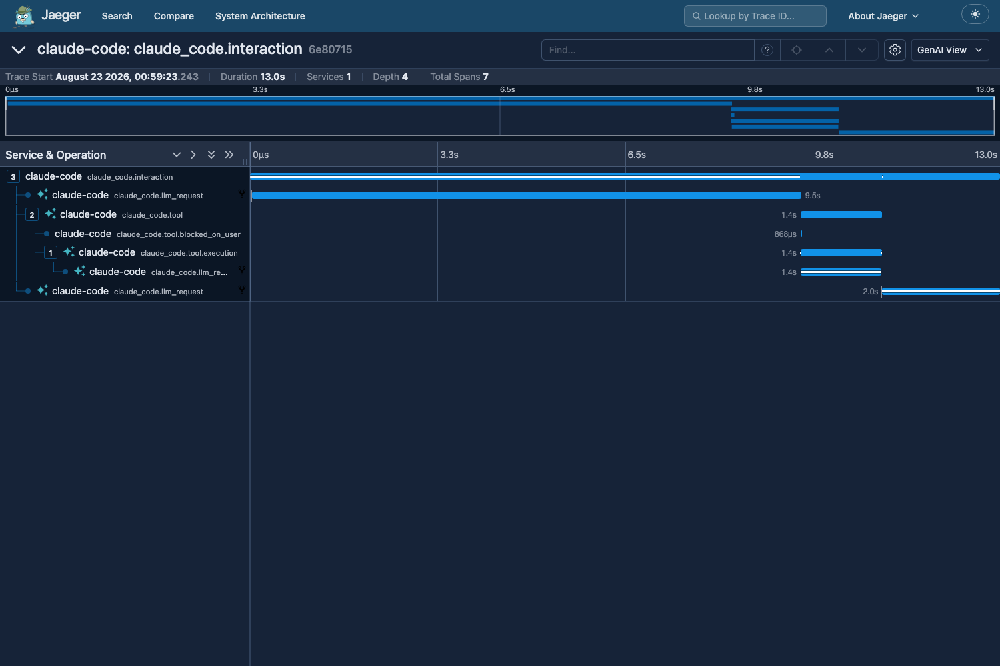

# claude-tracing

Runs a local OpenTelemetry Collector, Jaeger, and ClickHouse, and points Claude Code at
them. Open one session in a trace viewer and see where its time went; ask SQL questions
about a year of them.

All three are native binaries. There is no Docker, no VM, and nothing to install
globally — `./ct up` downloads three pinned executables into `var/bin` and starts them.

## Quickstart

```bash
./ct up                  # fetch binaries, start the stack, wait until it answers
./ct claude              # work normally, traced and labelled
open http://127.0.0.1:16686

./ct sql "SELECT Model, sum(OutputTokens) FROM claude.spans
          GROUP BY 1 FORMAT PrettyCompact"
```

`./ct claude` runs Claude in whatever directory you are standing in, so from another
project you call it by path — `~/code/claude-tracing/ct claude` — or alias it. It prints
the labels it stamped before handing over, and passes every argument through, so
`./ct claude -p 'hi'` and `./ct claude --resume` work as usual.

To prove the whole path works before you trust it:

```bash
./ct verify
```

Three stages, cheapest first. It checks the label encoding without touching the network.
It sends a synthetic trace, metric and log through the collector and waits for all four
sinks to hand them back. Then it runs a real one-prompt session through the launcher and
waits for that session in the same four — plus a Jaeger tag search on the labels it was
launched with, a ClickHouse row whose promoted columns are populated rather than merely
present, the tokens that session spent being attributable to the tool call it made, and
every one of its requests carrying a price so the session has a cost in dollars.

Each stage picks a session id before it emits anything and then asks every sink for that
exact string, so a pass means this run's data arrived, not that an older trace is still
lying around. Nothing the stack writes sits outside that check: break any one exporter
and verify goes red naming the sink that lost the run.

## What you get



One trace per prompt. A turn that ran a single Bash command looks like this:

```
claude_code.interaction              3523.9ms   user_prompt="Run the bash command …"
├─ claude_code.llm_request           2136.0ms   model=claude-opus-5[1m] ttft_ms=1093
│                                               input_tokens=2 output_tokens=85
│                                               cache_read_tokens=0 stop_reason=tool_use
├─ claude_code.tool                   605.0ms   tool_name=Bash
│                                               full_command="echo claude-tracing-selftest"
│  ├─ claude_code.tool.blocked_on_user   4.5ms  ← how long you took to approve it
│  └─ claude_code.tool.execution       600.3ms
└─ claude_code.llm_request            752.0ms   cache_read_tokens=26923 stop_reason=end_turn
```

Every span carries `session.id`, so a Jaeger tag search on one id pulls up every turn
of a session. Subagents land in the same trace as the `Agent` call that spawned them:
the tool span is tagged `subagent_type=general-purpose`, and the requests the subagent
makes are tagged with its `agent_id`. Those two tags are on different spans, which
matters once you start counting tokens — see [Subagents need a join](#subagents-need-a-join-and-its-easy-to-get-wrong).
Claude Code also documents a `parent_agent_id` for nested agents; no session traced here
has produced one yet.

The `blocked_on_user` span is the one worth knowing about: it separates the time Claude
spent working from the time it spent waiting on you to hit approve.

Jaeger 2.20 also has a **GenAI View** toggle in the trace header, next to the search
box, which reads the `gen_ai.*` attributes Claude Code sets.

## Knowing what a session was for

Claude Code's own attributes describe the session — model, tokens, timings, identity —
and say nothing about the work. So "how many turns did that ticket take" has nothing to
group by, and no storage engine fixes that later: an attribute that was never emitted
can't be backfilled. `./ct claude` fills the gap, stamping onto every span of the session:

| Attribute | Value |
| ------------------------------ | ------------------------------------------------ |
| `vcs.repository.name`          | the git repository's directory name              |
| `vcs.ref.head.name`            | the current branch; absent on a detached HEAD    |
| `process.working_directory`    | where you launched from                          |

Those are OpenTelemetry semantic conventions rather than names invented here, and they
arrive as Jaeger *process* tags — so one tag search pulls every span of every session
that ran in a given repo or on a given branch. Launch somewhere that isn't a git
checkout and the two `vcs.*` labels are simply absent, which reads as "doesn't apply"
rather than as a branch whose name is the empty string.

Whatever you set in `OTEL_RESOURCE_ATTRIBUTES` yourself is kept and merged, so you can
label the things this repo can't derive — like what the session is *for*:

```bash
OTEL_RESOURCE_ATTRIBUTES=session.purpose=code-review ./ct claude
```

One warning, measured rather than assumed: a single raw space anywhere in
`OTEL_RESOURCE_ATTRIBUTES` makes Claude Code discard *every* attribute in the string,
silently, including the well-formed ones beside it. `ct claude` percent-encodes what it
derives and refuses to launch if what you passed in would poison the set. If you set that
variable by hand for a plain `claude`, encode the spaces as `%20` yourself.

The labels describe the directory you launched from, which is why they are computed at
launch and are not part of `./ct env`. A shell that sourced the env in one repo would go
on claiming that repo long after you'd moved to another.

## How it's wired

Claude Code emits three OTLP signals, and Jaeger accepts exactly one of them. Point
Claude straight at Jaeger and its metrics and logs pipelines get `Unimplemented` back —
two thirds of the telemetry disappears without anyone telling you. The collector exists
to give each signal a real sink:

```
claude  ──OTLP/gRPC──▶  collector :4317  ──traces──┬▶ jaeger :14317 ──▶ badger    7 days
                                                   └▶ clickhouse :9000 ──▶ SQL    1 year
                                         ──metrics─▶  :8889/metrics (Prometheus format)
                                         ──logs────▶  var/log/claude-events.jsonl
```

Traces go to two sinks because they answer two different questions. Badger is what
Jaeger reads to draw one trace, and it holds a week. ClickHouse holds a year and answers
`sum(tokens) group by month`. Neither depends on the other: if the ClickHouse path
breaks, viewing still works, and the reverse.

Jaeger 2.20 does ship its own ClickHouse backend, and this deliberately doesn't use it —
the binary prints `WARNING: ClickHouse Storage is Experimental` on the way up, and
there's no reason to put a working viewer behind that.

| Port    | What                                                        |
| ------- | ----------------------------------------------------------- |
| `4317`  | Collector OTLP gRPC — the only address Claude is ever given |
| `4318`  | Collector OTLP HTTP                                         |
| `16686` | Jaeger UI and query API                                     |
| `8123`  | ClickHouse over HTTP — what `./ct sql` talks to             |
| `8889`  | Claude's metrics: cost in USD, tokens by type, session count |
| `9000`  | ClickHouse native protocol, which the collector writes to    |
| `14317` | Jaeger's OTLP receiver, moved aside so the collector owns 4317 |

Ports, versions, and binary checksums are all defined once, in `lib/common.sh`. The three
YAML configs read them back rather than restating them — the two collectors through
OpenTelemetry's `${env:...}` expansion, ClickHouse through its own `@from_env` — so there
is no second copy to drift.

Jaeger v2 is itself a Collector distribution, which is why `config/jaeger.yaml` and
`config/collector.yaml` look alike: same schema, same `--config` flag. `ct` treats all
three services as the same kind of thing — something to launch, and an HTTP question
whose answer means "ready" — and starts them by iterating a table rather than by
branching. The command line is part of that table, because ClickHouse disagrees with the
other two about how to be told where its config is.

For ClickHouse that readiness question does more than it looks: it's a `SELECT` against
the span table, not a ping. ClickHouse creates that table itself on startup, so the probe
can't pass until the schema is really there — which is why nothing in `ct` runs
migrations, and why the collector never starts before there's something to insert into.

## Asking questions in SQL

`./ct sql` runs a query against `claude.spans` and prints the answer. It passes the query
through untouched, so the output shape is yours to pick by ending it with `FORMAT
PrettyCompact` for reading or leaving the default tab-separated for piping.

```bash
./ct sql "SELECT toYYYYMM(Timestamp) AS month,
                 uniq(SessionId)     AS sessions,
                 sum(OutputTokens)   AS written
          FROM claude.spans
          WHERE SpanType = 'llm_request'
          GROUP BY 1 ORDER BY 1 FORMAT PrettyCompact"
```

Every span attribute survives in the `SpanAttributes` and `ResourceAttributes` maps, so
nothing is lost. On top of that, the attributes the interesting questions group by are
promoted to real columns, computed once when the row is inserted:

| Column | From |
| ---------------------------------------------------------- | ----------------------------------- |
| `SpanType` | `interaction`, `llm_request`, `tool`, `tool.execution`, `tool.blocked_on_user` |
| `SessionId`, `InteractionSequence` | which session, and which turn within it |
| `Model`, `ToolName`, `StopReason` | the obvious grouping keys |
| `InputTokens`, `OutputTokens`, `CacheReadTokens`, `CacheCreationTokens` | as emitted |
| `ContextTokens` | input + cache-read + cache-creation: the proxy for context size |
| `AgentId`, `ParentAgentId`, `SubagentType`, `RequestContext` | subagents, below |
| `Repository`, `Branch`, `WorkingDirectory` | the labels `./ct claude` stamps |

`ContextTokens` is stored rather than computed per query on purpose. Claude Code emits no
context-size attribute, so any answer about context size is a sum of three other fields —
and a definition retyped in every query is a definition that eventually differs between
two of them. It's written down once, in `config/clickhouse.yaml`.

The table is partitioned by month, sorted by `(SpanType, SessionId, Timestamp)`, and
holds a year. Those three are set at creation and are migrations afterwards, which is why
this repo creates the table rather than letting the exporter do it — the exporter's
defaults are daily partitions, a 30-day TTL, and a sort key led by a column that only
ever holds `claude-code`.

### Subagents need a join, and it's easy to get wrong

Almost everything Claude does on your behalf happens inside a subagent, so "where did my
tokens go" usually means *which subagent*. The awkward part is that the two attributes
you need land on different spans:

```
claude_code.tool  tool_name=Agent  subagent_type=general-purpose   ← the type is here
└─ claude_code.tool.execution
   └─ claude_code.llm_request  agent_id=a09810…  ← the tokens are here
```

They never appear on the same row, so attributing tokens to a *kind* of subagent is a
two-hop walk up the span tree. That walk is written once as a view, so no query has to
rediscover it:

```bash
./ct sql "SELECT SubagentType, count() AS requests, sum(OutputTokens) AS out_tok
          FROM claude.subagent_requests
          GROUP BY 1 ORDER BY out_tok DESC FORMAT PrettyCompact"
```

When the *kind* doesn't matter, skip the join: `RequestContext` reads `tool` on a
subagent's own requests and `interaction` on the main agent's.

### Tokens spent on tool usage, in a named month

```bash
./ct sql "SELECT sum(TotalTokens)                   AS all_tokens,
                 sumIf(TotalTokens, ServesToolCall) AS tool_tokens,
                 sum(ToolResultTokens)              AS tool_output
          FROM claude.llm_requests
          WHERE toYYYYMM(Timestamp) = 202603 FORMAT Vertical"
```

Expect `tool_tokens` to come back as nearly all of `all_tokens`. That is the answer, not a
bug: an agentic session *is* a tool loop, and almost every request in one either called a
tool or read what a tool returned. The measured figures, and how big a sample they rest on,
are in [docs/analytics-findings.md](docs/analytics-findings.md).

The question needs a definition and not just a query, because the spans don't contain the
link. Tokens live on `llm_request` spans, tools live on `tool` spans, and the two are
siblings under an interaction — nothing joins a token count to a tool call. What connects
them is the order requests arrive in. A request ending in `stop_reason = 'tool_use'` is the
model deciding to call a tool, and the request after it under the same parent is the one
carrying that tool's output back into context. The second is where the money is: a tool
returning 40 KB is billed on the following request, not its own.

So `claude.llm_requests` counts a request as serving a tool call when it did any of three
things — decided to call one (`EndedInToolCall`), carried one's result
(`CarriesToolResult`), or ran inside one (`RequestContext = 'tool'`, which is a subagent).
It's a union over requests rather than a sum over tool calls, so a request that did all
three is still counted once and `tool_tokens` can never exceed `all_tokens`. All three
clauses stay visible as their own columns, so you can always take the union back apart.

`ToolResultTokens` is the smaller, sharper number underneath: how far the context grew
beyond what the model itself wrote, which is the tool's output measured in tokens. It lands
a couple of orders of magnitude below `tool_tokens` — a fraction of one percent of the
bill. Both numbers are true and they answer different questions: tools *cause* nearly all
the spend, and tool output *is* nearly none of it. Everything between the two is context
getting re-read on every turn of the loop.

### The same question in dollars

```bash
./ct sql "SELECT round(sum(CostUSD), 2)                   AS all_usd,
                 round(sumIf(CostUSD, ServesToolCall), 2) AS tool_usd
          FROM claude.llm_requests
          WHERE toYYYYMM(Timestamp) = 202603 FORMAT Vertical"
```

One rule matters more than the rest: **never multiply `TotalTokens` by a price.** The four
token counts bill at rates spanning a factor of fifty, and the mix is lopsided enough that
a blended rate comes out wrong by a large factor rather than a small one. `CostUSD`
multiplies each count by its own rate and sums the four, so use it and the trap never
comes up.

The components stay beside it — `InputCostUSD`, `CacheReadCostUSD`,
`CacheCreationCostUSD`, `OutputCostUSD` — because "cache reads or output?" is the usual
next question, and because each one's share of the bill is nothing like its share of the
tokens. The cheapest component supplies almost all the tokens and, through sheer volume,
still most of the bill; the two dearest supply more than a third of the bill from about a
fortieth of the tokens. That disproportion is precisely what a single blended rate erases.
Ask your own store rather than trusting a figure quoted here, because these move as data
accumulates:

```bash
./ct sql "SELECT round(100*sum(CacheReadCostUSD)/nullIf(sum(CostUSD), 0), 1)     AS cache_read_pct_spend,
                 round(100*sum(CacheReadTokens)/nullIf(sum(TotalTokens), 0), 1)  AS cache_read_pct_tokens,
                 round(100*sum(OutputCostUSD)/nullIf(sum(CostUSD), 0), 1)        AS output_pct_spend,
                 round(100*sum(OutputTokens)/nullIf(sum(TotalTokens), 0), 1)     AS output_pct_tokens
          FROM claude.llm_requests WHERE Priced FORMAT Vertical"
```

Run before your first session, that answers `NULL` four times rather than erroring: the
`nullIf` guards are there because dividing a `Decimal` by zero raises in ClickHouse, and a
store with no priced requests yet is the state every fresh `./ct up` starts in.

`WHERE Priced` is what keeps the two halves comparable. An unpriced request costs zero by
construction but still carries its real token counts, so without it the spend shares would
be computed over one population and the token shares over a larger one — and the gap
between them, which is supposed to show a pricing structure, would partly just be missing
rate rows.

No span carries a cost, so these are derived — token counts times `claude.model_prices`,
which is a rate table this repo owns and states in `config/clickhouse.yaml`. That has three
consequences worth knowing before you trust a figure:

- **Cost reaches back to before cost existed.** The token counts were always on the spans,
  so adding this feature made every session already in the store costable — which
  capturing Anthropic's counter could never have done. What it does *not* do is backfill
  across a price boundary: prices carry an `EffectiveFrom`, the join takes the rate in
  force at each request's own timestamp, and a span older than the earliest matching row
  comes back `Priced = false` rather than costed at a rate nobody checked against it.
  Adding tomorrow's price leaves last month's answer untouched; reaching further back
  means adding a row dated early enough, which is a claim about a past price you should be
  able to stand behind.
- **An unknown model costs nothing, loudly.** A model missing from the rate table gets
  zeros, and zero dollars looks exactly like a free request. The `Priced` column separates
  those two, and `ct verify` fails when any request in its probe session comes back
  unpriced, naming the model. Expect this the first time you run a model that isn't in the
  table — Claude Code picks the model, so the table can only cover what has been measured.
  Adding one is the maintenance step, and measuring its rate rather than copying a
  published one is the point: both surprises so far (a suffixed model carrying no premium,
  a cache rate set by the client's cache TTL) were cases where the measured figure and the
  documented one disagreed.
- **The rates were measured, not looked up — with two exceptions, named.** Claude Code
  publishes its own cost counter on `:8889`, computed independently, and every rate was
  reconciled against it that there was traffic to reconcile — to the limit of what that
  counter can state, since it is emitted as a float and the decimal computed here is the
  more exact of the two. The exceptions are Haiku's cache-read and cache-creation rates:
  no Haiku request in this store has ever touched the cache, so there is no series to
  check them against and they remain Opus's published multipliers carried over.
  `docs/analytics-findings.md` marks which is which. The reconciliation turned up one surprise
  (`claude-opus-5[1m]` carries no long-context premium) and one caveat (cache creation
  bills at 2× input because of the one-hour cache TTL, which no span records).
  [docs/analytics-findings.md](docs/analytics-findings.md) has the procedure, so a future
  price change can be re-measured rather than guessed.

`claude.subagent_requests` carries the same cost columns, so "which kind of subagent is
expensive" is a `GROUP BY SubagentType` on `sum(CostUSD)`. It gets them by selecting from
`claude.llm_requests` rather than from the span table, which keeps the money arithmetic in
one place: a subagent's cost is whatever its requests already cost, never a second
multiplication that could drift from the first.

The view carries the rest of the request-level columns too (`Model`, `Repository`,
`Duration`, the four raw token counts), so the next question is usually a `GROUP BY` away
rather than a new definition. The definition itself lives in `config/clickhouse.yaml`, and
`ct verify` re-checks the pairing on every run, because this is the piece that fails
quietly. A renamed `stop_reason` would take out two of the three clauses; the third reads a
different attribute entirely and would go on marking every subagent request, so the number
comes back a large, plausible undercount rather than an obvious zero.

## What gets recorded

None of this leaves the machine, but it is more than timings. The default env printed by
`./ct env` records:

- **Your prompt text**, verbatim, as `user_prompt` on the root span (`OTEL_LOG_USER_PROMPTS=1`).
- **Bash commands, file paths, skill names, and subagent types** on tool spans (`OTEL_LOG_TOOL_DETAILS=1`).
- **Your email, account UUID, and organization id** as labels on every metric. That is
  Claude Code's own default label set, not something this repo adds.
- **The repository, branch, and absolute working directory** you launched in, on every
  span of a session started with `./ct claude`. This one *is* something this repo adds.

Tool inputs and outputs are *not* captured. Add `export OTEL_LOG_TOOL_CONTENT=1` after
sourcing if you want them — every file you read and every command's output becomes a
span event, truncated at 60 KB each. It makes traces large.

## Operating it

```bash
./ct status    # is each service running, and is it answering
./ct logs      # tail both service logs
./ct ui        # open Jaeger
./ct down      # stop
```

Every span is written to both sinks and expires on each sink's own clock. Badger keeps 7
days under `var/jaeger` (`CT_TRACE_TTL` in `lib/common.sh`); ClickHouse keeps a year under
`var/clickhouse` (the `TTL` clause in `config/clickhouse.yaml`, which can't be an
`@from_env` because ClickHouse substitutes whole values, never pieces of a query). Both
survive restarts. To start either one clean, `./ct down` and delete its directory.

A year is expected to land in 150–400 MB. That estimate is reasoned rather than measured
— about 60% of every span is the same identity block repeated verbatim, which a columnar
store collapses to almost nothing — so check it rather than trust it once there's a real
year in there.

Everything under `var/` is disposable and gitignored — binaries, pidfiles, logs, and
storage all come back from `./ct up`.

If you'd rather trace every session without going through the launcher, paste the output
of `./ct env` into the `env` block of `~/.claude/settings.json`. Claude Code will then try
to export whether or not the stack is up. That route carries the transport but not the
work-unit labels, which have to be computed per launch — those sessions land in Jaeger
with no repo and no branch on them.

## Troubleshooting

**No `claude-code` service in the Jaeger dropdown.** Spans are a beta feature gated on
`CLAUDE_CODE_ENHANCED_TELEMETRY_BETA=1`, which `./ct env` sets. If they still don't
arrive, your build or account may not have it — verified working on Claude Code 2.1.226.
Run `./ct verify`: if stages 1 and 2 pass and stage 3 fails to find the session in any
sink at all, the stack is fine and the problem is on Claude's side. A stage 3 that finds
the session and then fails on one of its later assertions is the opposite situation —
spans are arriving in a shape this repo no longer expects, and the message names the file
to edit.

**Spans arrive with no repo or branch on them.** They were emitted by a `claude` that
didn't go through `./ct claude` — a shell that sourced `./ct env`, or the settings.json
route. Both carry the transport and neither carries the labels.

**A service won't start.** `./ct up` prints the last 20 lines of that service's log
before giving up. The full logs are in `var/log/`.

**Spans are in Jaeger but not in ClickHouse.** Then the collector received them and the
ClickHouse exporter is what didn't deliver, which `./ct verify` reports as a stage-2
failure. The likeliest cause is the exporter's `INSERT` no longer matching the table:
a collector upgrade that adds a column does exactly this. The error is in
`var/log/collector.log`, and the table is in `config/clickhouse.yaml`.

**`:8889/metrics` answers `200` with an empty body.** Nothing has reached the Prometheus
exporter, so it has nothing to serve — the metrics pipeline is broken, not the endpoint.
It looks healthy to anything that only checks the status code, which is why `./ct verify`
asks for a session id in the body instead. The error is in `var/log/collector.log`.

**Spans are slow to appear.** Claude batches exports every 5 seconds and the collector
batches for 2 more, so allow about 10 seconds after a turn ends.

**Port conflict.** Change the port in `lib/common.sh` and restart; both configs pick up
the new value.

## Adding another platform

`ct_tool_pins()` in `lib/tools.sh` pins the sha256 of each binary for darwin/arm64 only.
On any other platform `./ct up` stops and tells you what to add rather than installing
something unverified: download the release artifact, run `shasum -a 256` on it, and add a
row.

Each row carries an `extract` field — a filter that reads the download on stdin and writes
the binary on stdout. Jaeger and the collector ship tarballs, so theirs is `tar xzOf -
<member>`; ClickHouse ships a bare binary, so its is `cat`. A project that publishes a zip
is a new value in that column, not a new branch.

Pin the hash of what you downloaded, not of the installed file. ClickHouse ships
self-extracting and rewrites itself the first time it runs — 161 MB becomes 855 MB and the
hash changes for good — so `./ct up` records what it verified in a `.verified` file beside
the binary instead of re-hashing something the program owns.
